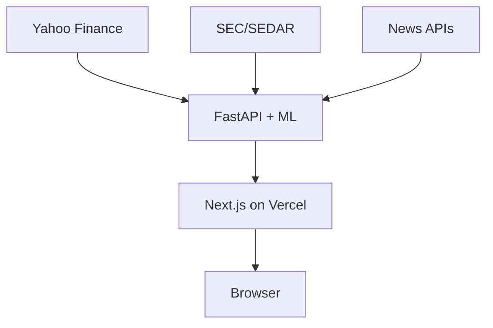

# MarketPulse — AI-Powered Stock Analysis \U0001F4C8\U0001F916

[](https://vercel.com)
[](https://aws.amazon.com/ec2/)
[](https://www.python.org/)
[](https://nextjs.org/)
[](https://fastapi.tiangolo.com/)

MarketPulse delivers institutional-grade analytics to everyday investors. Search any
equity, ETF, or crypto ticker and instantly receive price history, machine-generated
predictions, pattern recognition, and sentiment-scored headlines—all in a single,
responsive interface.

## Overview

**Why?** Markets move fast. Retail traders, finance students, and quant developers
need actionable insights without juggling multiple tools. MarketPulse consolidates
data, AI models, and modern visualisations into one open-source platform.

## Features

- \U0001F50D **Ticker search** via Yahoo Finance API for stocks, ETFs, and crypto.
- \U0001F4C9 **Price charts** with 1m–5y ranges and real-time updates using Recharts.
- \U0001F916 **AI price predictions** from global LSTM models with per-ticker calibration
  retrained on a 90‑day rolling window.
- \U0001F50E **YOLOv8 candlestick pattern detection** on auto-generated chart images.
- \U0001F4F0 **News feed** enriched with DistilRoBERTa sentiment analysis.
- \U0001F4C4 **Filings & fundamentals** tab integrating SEC and SEDAR data.
- \U0001F3A8 **Dark/light theme** optimized for mobile and desktop via TailwindCSS.

### Infrastructure Highlights

- Frontend hosted on **Vercel** with automatic deploys from GitHub.
- Backend served by **FastAPI** on an **AWS EC2** instance behind Nginx and Gunicorn.
- **Papermill** executes scheduled notebooks for model retraining.
- **Cloudflare Tunnel** enables secure local development without opening ports.

## Tech Stack

| Layer      | Technologies |
|------------|--------------|
| Frontend   | Next.js 15, React 18, TailwindCSS, shadcn/ui, Recharts, Framer Motion |
| Backend    | FastAPI, Python 3.11, Nginx, Gunicorn |
| ML / AI    | HuggingFace models, custom LSTM, PPO RL agent, YOLOv8, Papermill |
| Deployment | Vercel (frontend), AWS EC2 (backend) |

## Architecture



## Installation & Local Development

### Prerequisites

- Node.js 18+
- Python 3.11+
- `pip` & `venv`

### Clone Repository

```bash
git clone https://github.com/your-org/marketpulse.git
cd marketpulse
```

### Frontend

```bash
cd frontend
npm install
npm run dev
```

### Backend

```bash
cd backend
python -m venv venv
source venv/bin/activate
pip install -r requirements.txt
uvicorn app:app --reload
```

### Environment Variables

Create `.env` files in both `/frontend` and `/backend` as needed:

```env
YAHOO_API_KEY=your_key
HUGGINGFACE_API_TOKEN=your_token
OPENAI_API_KEY=your_key
```

## Deployment Notes

### Backend (EC2)

```bash
# systemd service example
sudo systemctl restart marketpulse
sudo journalctl -u marketpulse -f
```

Nginx reverse-proxies Gunicorn, and the app runs inside a Python virtual environment.

### Frontend (Vercel)

Push to `main` and Vercel automatically builds and deploys.

## Screenshots

| Landing Page | Ticker Overview | Predictions |
|--------------|----------------|-------------|
|  |  |  |

## Contributing

1. Fork the repo & create a feature branch.
2. Run `npm lint` and `pytest` before submitting.
3. Open a pull request with a clear description and screenshot/GIF if applicable.

## License

MIT License © 2024 MarketPulse

